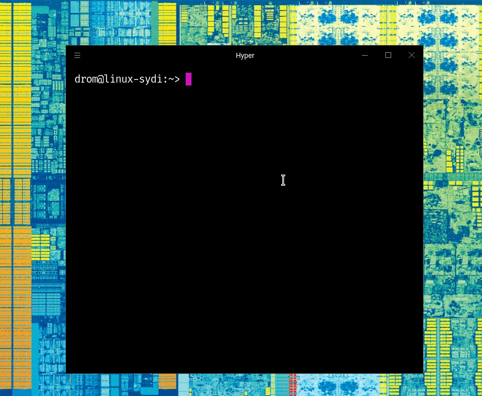

It's me, Aliaksei Chapyzhenka and I forked this card from [Tierney](https://github.com/bnb/bitandbang)!



# Usage
Via npx:
```
npx drom
```

Not including how to use it globally because I'm not sure why you'd want this as a global command. That'd be creepy.
